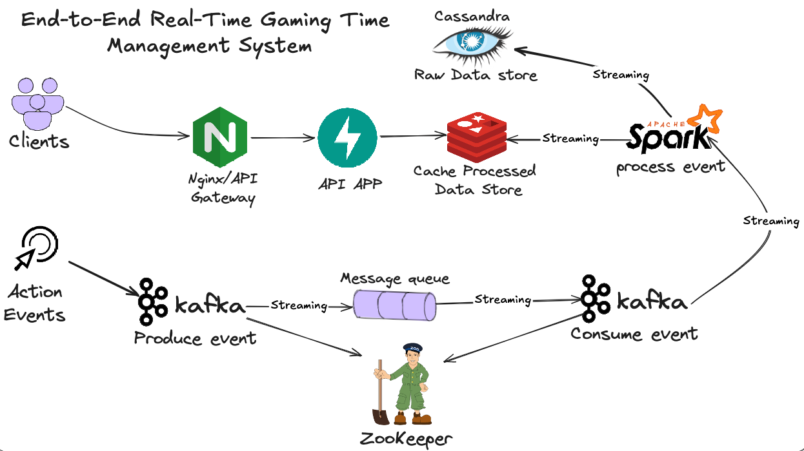
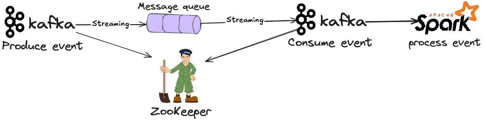
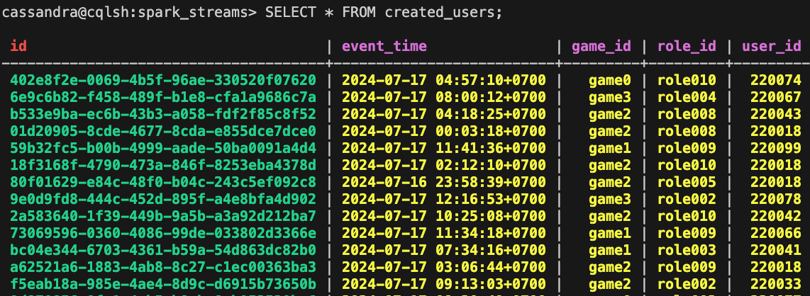
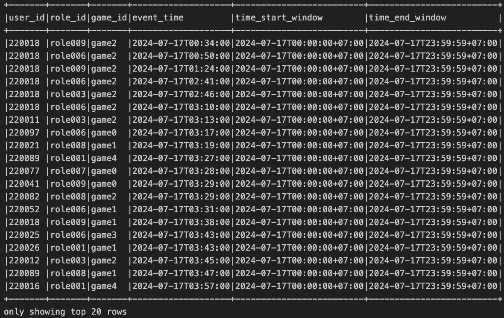
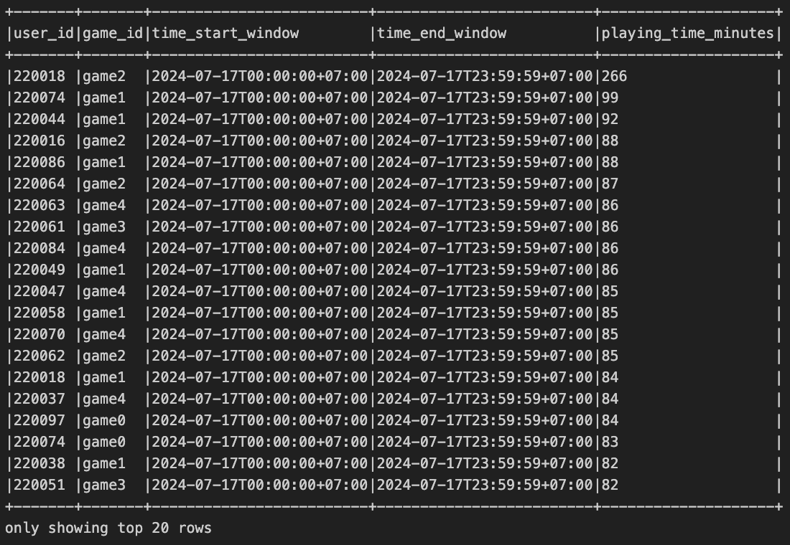

# End-to-End Real-Time Gaming Time Management System

This project contains the design and implementation of an End-to-End Real-Time Gaming Time Management System. The system ensures compliance with the Gaming Restriction Law, which mandates:

- Users under 18 can play a single game for a maximum of 60 minutes per day.
- The total gaming time across all games must not exceed 120 minutes per day.

The architecture captures, processes, and exposes gaming session data via an API to enforce these rules in real-time, using: **Kafka, Spark, Cassandra,Redis** and **FastApi**.



## Main Requirements:
**Time Window**
- The playing time is calculated within a strict 24-hour window.
- The window starts at 12:00 AM and ends at 11:59 PM (UTC+7).
- At the beginning of each new day, the playing time resets automatically.
**Calculation Logic**
-   **Event Collection:**
    - User events are captured in real-time with minute-level granularity to ensure accuracy.
- **Online Time Calculation:**
    - The system calculates distinct active minutes per user across all games.
    - Duplicate or overlapping minutes are ignored to prevent inflated results.
    - Final playing time is the sum of unique active minutes within the time window.

## Getting Started

### Project files:

- [Fetch and produce events](plugins/produce_kafka.py): Fetches latest events from the API and produces them to the Consumer in message queue using **Kafka**.
- [Consume events](plugins/spark_streaming.py): Consumes events from the message queue, processes them with Spark Streaming, and stores raw data in **Cassandra** and processed data in **Redis** for real-time access.
- [FetchAPi](plugins/plugins/fetch_api.py): Clients want to capture, process, and expose gaming session data via an API to enforce the rules in real-time using **FastAPI**. 
- Reset per day: Using [cronjob](cronfile) and [flushdb](plugins/flushdb.py) Resets the gaming time for all user at the beginning of a new day at 00:00 AM
- [Docker-compose](docker-compose.yaml): To run images of Kafka, Cassandra, Redis, and Spark, and create a network for them to communicate.
- [requirements.txt](requirements.txt): Contains all the required libraries to run the project.

### System Process:

<p align="center">
  
</p>

#### 1. Data Ingestion (Kafka Producer & ZooKeeper): [produce_kafka](plugins/produce_kafka.py)

- **Source:** Fetches the latest action events from the [HTTP Link](https://github.com/ntd284/VNG-Assignment/raw/refs/heads/main/files/sample_file.json) (sample action events created by **AI**)

<p align="center">
  
</p>

- **Message Queue:** Kafka hadles message queueing for real-time processing with topic `eventstream`.
- **Coordinating Service:** ZooKeeper manages the Kafka cluster state and configuration.

#### 2. Consume and Process Events: [spark_streaming](plugins/spark_streaming.py)

- **Consumer:** Consumes events from the message queue using Spark Streaming.
- **Event Schema:** The schema of the event data is as follows:
    - `user_id`: Unique identifier of the user.
    - `game_id`: Unique identifier of the game.
    - `event_time`: Timestamp of the event.
    - **Raw Data:** Stores raw data in Cassandra for backup and historical analysis.
<p align="center">
  
</p>

- **Transformation:**
    - **Transform format of the event_time** to the nearest minute (e.g., 2021-09-01T12:34:12.003 -> 2021-09-01 12:34:00).
    - **Calculate the period** of start and end of the time window for each event.
    - **Filter out events** that are not within the time window.
```
    timestamp_format = "yyyy-MM-dd'T'HH:mm:ss.SSS"
    dateformats = "yyyy-MM-dd'T'HH:mm:00"
    start_window = "yyyy-MM-dd'T'00:00:ssXXX"
    end_window = "yyyy-MM-dd'T'23:59:59XXX"
    date = "yyyy-MM-dd"

    transformed_eventtime_df = event_df.withColumn("event_time", to_timestamp(col("event_time"), timestamp_format)) \
        .withColumn("event_time", date_format(col("event_time"), dateformats)) \
        .withColumn("time_start_window", date_format(col("event_time"), start_window)) \
        .withColumn("time_end_window", date_format(col("event_time"), end_window)) \
        .dropDuplicates() \
        .filter(date_format(col('event_time'), date) == DATE_SAMPLE)
```
**Output:**
<p align="center">
  
</p>

   - **Calculated specific active minutes:** The system calculates distinct active minutes per user across all games based on the event data with logic:
        - Duplicate or overlapping minutes are ignored to prevent inflated results.
        - Final playing time is the sum of unique active minutes within the time window.
```
    specific_time_df = transformed_eventtime_df.groupBy("user_id", "game_id", "time_start_window", "time_end_window") \
        .agg(approx_count_distinct(struct("user_id", "game_id", "event_time")).alias("playing_time_minutes"))
```
**Output:**
<p align="center">
  
</p>
    