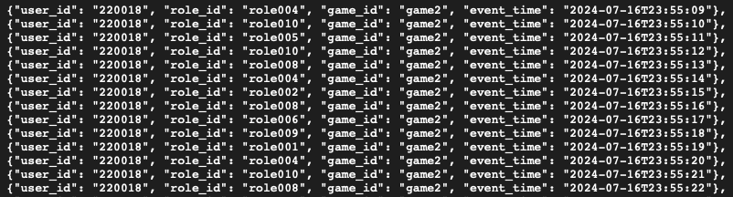

# End-to-End Real-Time Gaming Time Management System

This project contains the design and implementation of an End-to-End Real-Time Gaming Time Management System. The system ensures compliance with the Gaming Restriction Law, which mandates:

- Users under 18 can play a single game for a maximum of 60 minutes per day.
- The total gaming time across all games must not exceed 120 minutes per day.

The architecture captures, processes, and exposes gaming session data via an API to enforce these rules in real-time, using: **Kafka, Spark, Cassandra,Redis** and **FastApi**.


### The reason for choosing this architecture is to ensure:
- **Horizontal Scalability:** **Kafka**, **Spark**, **Cassandra**, and **Redis** can be scaled horizontally to handle large volumes of data.
- **Data Durability:** **Cassandra** provides high availability and durability for raw data storage.
- **High Availability:** **Redis** provides fast read access to processed data for real-time enforcement.
- **Fast Processing:** **Spark** Streaming processes events in real-time to calculate gaming time.
- **Fast Data Access:** **FastAPI** exposes gaming session data via an API for real-time enforcement to fetch result from Redis directly.

## Main Requirements:
**Time Window**
- The playing time is calculated within a strict 24-hour window.
- The window starts at 12:00 AM and ends at 11:59 PM (UTC+7).
- At the beginning of each new day, the playing time resets automatically.
**Calculation Logic**
-   **Event Collection:**
    - User events are captured in real-time with minute-level granularity to ensure accuracy.
- **Online Time Calculation:**
    - The system calculates distinct active minutes per user across all games.
    - Duplicate or overlapping minutes are ignored to prevent inflated results.
    - Final playing time is the sum of unique active minutes within the time window.
- **Load Assumption:**
    - Active Daily Users: Up to 1 million users.
    - Event Throughput: Around 2,000 events per user per day.
    - API Traffic: Handles 100 requests per second on REST API endpoints.
    - Performance SLA: 99th percentile latency under 500ms.

## Getting Started

### Project files:

- [Fetch and produce events](plugins/produce_kafka.py): Fetches latest events from the API and produces them to the Consumer in message queue using **Kafka**.
- [Consume events](plugins/spark_streaming.py): Consumes events from the message queue, processes them with Spark Streaming, and stores raw data in **Cassandra** and processed data in **Redis** for real-time access.
- [FetchAPi](plugins/plugins/fetch_api.py): Clients want to capture, process, and expose gaming session data via an API to enforce the rules in real-time using **FastAPI**. 
- Reset per day: Using [cronjob](cronfile) and [flushdb](plugins/flushdb.py) Resets the gaming time for all user at the beginning of a new day at 12:00 AM
- [Docker-compose](docker-compose.yaml): To run images of Kafka, Cassandra, Redis, and Spark, and create a network for them to communicate.
- [requirements.txt](requirements.txt): Contains all the required libraries to run the project.


### Installation for demo (On Linux):

1. Clone the repository and access to file:
```
git clone https://github.com/ntd284/Gaming_Time_Management_System.git
cd Gaming_Time_Management_System
```
2. Install Docker and Docker-compose (if not installed):
```
sudo ./installdocker.sh
docker --version
docker compose version
```
3. Run docker-compose to start Kafka, Cassandra, Redis, and Spark:
```
docker compose up -d
```
Check in Docker-desktop:


4. Install the required libraries:
```
pip install -r requirements.txt 
```
5. Run the project:
```
cd plugins                          # Access to plugins folder
python3 produce_kafka.py            # Fetch and produce events
python3 spark_streaming.py          # Consume and process events
uvicorn fetch_api:app               # Activate API app
```
6. Activate cronjob to reset the gaming time for all users at the beginning of a new day:
```
crontab cronfile
```
7. Check raw data in Cassandra database:
```
docker exec -it cassandra cqlsh -u cassandra -p cassandra localhost 9042    # Access to Cassandra
SELECT * FROM spark_streams.created_users;                                  # List all created users
```
8. Check processed data in Redis:
```
docker exec -it redis redis-cli                     # Access to Redis
KEYS *                                              # List all keys
HGETALL total_playing_time:{user_id}                # Get total playing time data
HGETALL specific_playing_time:{user_id}:{game_id}   # Get specific playing time data
```
9. Test the API using postman or browser:
```
GET http://localhost:8000/total_playing_time/user_id={user_id}                          #Total playing time
GET http://localhost:8000/specific_playing_time/user_id={user_id}&game_id={game_id}     #Specific playing time
```

### System Process:

<p align="center">
  
</p>

#### 1. Data Ingestion (Kafka Producer & ZooKeeper): [produce_kafka](plugins/produce_kafka.py)

- **Source:** Fetches the latest action events from the [HTTP Link](https://github.com/ntd284/VNG-Assignment/raw/refs/heads/main/files/sample_file.json) (sample action events created by **AI**)

<p align="center">
  
</p>

- **Message Queue:** Kafka hadles message queueing for real-time processing with topic `eventstream`.
- **Coordinating Service:** ZooKeeper manages the Kafka cluster state and configuration.

#### 2. Consume and Process Events: [spark_streaming](plugins/spark_streaming.py)

<p align="center">
  
</p>

- **Consumer:** Consumes events from the message queue using Spark Streaming.
- **Event Schema:** The schema of the event data is as follows:
```
[{
    "user_id": "String",        //Unique identifier of the user.
    "role_id": "String",        //Unique identifier of the role.
    "game_id": "String",        //Unique identifier of the game.
    "event_time": "datetime"    //Timestamp of the event.
}]
```
- **Raw Data:** Stores raw data in Cassandra for backup and historical analysis.

<p align="center">
  
</p>

- **Transformation:**
    - **Transform format of the event_time** to the nearest minute (e.g., 2021-09-01T12:34:12.003 -> 2021-09-01 12:34:00).
    - **Calculate the period** of start and end of the time window for each event.
    - **Drop duplicates** to prevent inflated results.
    - **Filter out events** that are not within the time window.
```
    timestamp_format = "yyyy-MM-dd'T'HH:mm:ss.SSS"
    dateformats = "yyyy-MM-dd'T'HH:mm:00"
    start_window = "yyyy-MM-dd'T'00:00:ssXXX"
    end_window = "yyyy-MM-dd'T'23:59:59XXX"
    date = "yyyy-MM-dd"

    transformed_eventtime_df = event_df.withColumn("event_time", to_timestamp(col("event_time"), timestamp_format)) \
        .withColumn("event_time", date_format(col("event_time"), dateformats)) \
        .withColumn("time_start_window", date_format(col("event_time"), start_window)) \
        .withColumn("time_end_window", date_format(col("event_time"), end_window)) \
        .dropDuplicates() \
        .filter(date_format(col('event_time'), date) == DATE_SAMPLE)
```
**Output:**
<p align="center">
  
</p>

- **Calculated specific active minutes:** The system calculates distinct active minutes per user across all games based on the event data with logic:
    - Duplicate or overlapping minutes are ignored to prevent inflated results 
    - Final playing time is the sum of unique active minutes within the time window.

```
# using `groupBy` and `approx_count_distinct` to deduplicate the same events then Count of playing minutes for each user and game

    specific_time_df = transformed_eventtime_df.groupBy("user_id", "game_id", "time_start_window", "time_end_window") \
        .agg(approx_count_distinct(struct("user_id", "game_id", "event_time")).alias("playing_time_minutes"))
```
**Output:**
<p align="center">
  
</p>

- **Calculate the total playing time:** The system calculates the total playing time across all games for each user within the time window.
    - The total playing time is the sum of unique active minutes across all games.

```
# using `groupBy` and `approx_count_distinct` to deduplicate the same events then Count of playing minutes for each user

    total_time_df = transformed_eventtime_df.groupBy("user_id", "time_start_window", "time_end_window") \
        .agg(approx_count_distinct(struct("user_id", "game_id", "event_time")).alias("playing_time_minutes"))
```
**Output:**
<p align="center">
  
</p>

- **Store processed data in Redis:** The system stores the processed data in Redis for real-time access.
    - Redis is an in-memory data structure store that can be used as a database, cache, and message broker.
    - The processed data is stored in Redis with the key as the user_id and the value as the total playing time.
```
    query_specific_time_df = specific_time_df.writeStream \
        .outputMode("update") \
        .foreachBatch(write_to_redis) \
        .option("checkpointLocation", CHECKPOINT_LOCATION_SPECIFIC) \
        .start()

    query_total_time_df = total_time_df.writeStream \
        .outputMode("update") \
        .foreachBatch(write_aggregate_to_redis) \
        .option("checkpointLocation", CHECKPOINT_LOCATION_TOTAL) \
        .start()
```
**Output:**
- List of all events saved in **Redis**
<p align="center">
    
</p>

- users with their total playing time saved in **Redis**
<p align="center">
    
</p>

- Users and games with their specific playing time saved in **Redis**
<p align="center">
    
</p>

#### 3. Fetch API: [Fetch_API](plugins/fetch_api.py)

<p align="center">
    
</p>

- Based on real-time data stored in Redis, the system exposes gaming session data via an API to enforce the rules in real-time with 2 endpoints:
    - **Get total playing time for a user:** Returns the total playing time for a user within the time window.
        - HTTP Request: `GET /total_playing_time/user_id={user_id}`

        <p align="center">
            
        </p>

    - **Get specific playing time for a user and game:** Returns the specific playing time for a user and game within the time window.
        - HTTP Request: `GET /specific_playing_time/user_id={user_id}&game_id={game_id}`

        <p align="center">
            
        </p>

#### 4. Reset per day: [cronjob](cronfile) and [flushdb](plugins/flushdb.py)

- At the beginning of a new day at 00:00 AM, the system resets the gaming time for all users with cronjob and flushdb.

```
# cronfile
0 0 * * * python3 plugins/flushdb.py >> logs/cronjob.log 2>&1
```

